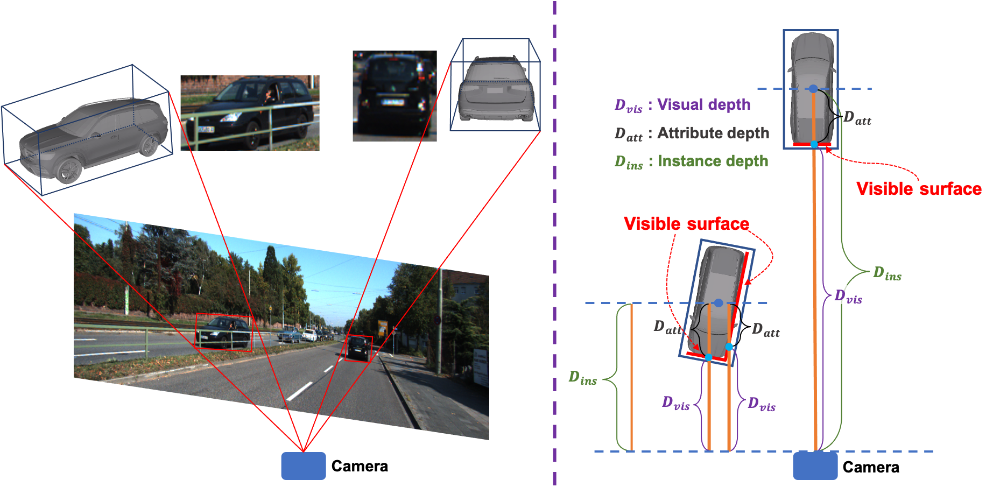

# DID-M3D

<p align="center">  </p>

## Introduction

This is the PyTorch implementation of the paper DID-M3D: Decoupling Instance Depth for Monocular 3D Object Detection, In ECCV'22, Liang Peng, Xiaopei Wu, Zheng Yang, Haifeng Liu, and Deng Cai.

## Abstract

Monocular 3D detection has drawn much attention from the community due to its low cost and setup simplicity. It takes an RGB image as input and predicts 3D boxes in the 3D space. The most challenging sub-task lies in the instance depth estimation. Previous works usually use a direct estimation method.  However, in this paper we point out that the instance depth on the RGB image is non-intuitive. It is coupled by visual depth clues and instance attribute clues, making it hard to be directly learned in the network. Therefore, we propose to reformulate the instance depth to the combination of the instance visual surface depth (visual depth) and the instance attribute depth (attribute depth). The visual depth is related to objects' appearances and positions on the image. By contrast, the attribute depth relies on objects' inherent attributes, which are invariant to the object affine transformation on the image. Correspondingly, we decouple the 3D location uncertainty into visual depth uncertainty and attribute depth uncertainty. By combining different types of depths and associated uncertainties, we can obtain the final instance depth. Furthermore,  data augmentation in monocular 3D detection is usually limited due to the physical nature, hindering the boost of performance.  Based on the proposed instance depth disentanglement strategy, we can alleviate this problem. Evaluated on KITTI, our method achieves new state-of-the-art results, and extensive ablation studies validate the effectiveness of each component in our method.

## Overview

- [Installation](#installation)
- [Getting Started](#getting-started)
- [Pretrained Model](#pretrained-model)
- [Citation](#citation)

## Installation

### Installation Steps

a. Clone this repository.

```shell
git clone https://github.com/SPengLiang/DID-M3D
```

b. Install the dependent libraries as follows:

* Install the dependent python libraries: 
  
  ```shell
  pip install torch==1.10.0 torchvision==0.11.1 pyyaml scikit-image opencv-python numba tqdm
  ```

* We test this repository on Nvidia 3080Ti GPUs and Ubuntu 18.04. You can also follow the install instructions in [GUPNet](https://github.com/SuperMHP/GUPNet) (This respository is based on it) to perform experiments with lower PyTorch/GPU versions.

## Getting Started

### Dataset Preparation

* Please download the official [KITTI 3D object detection](http://www.cvlibs.net/datasets/kitti/eval_object.php?obj_benchmark=3d) dataset and organize the downloaded files as follows:

```
DID-M3D
├── data
│   │── KITTI3D
|   │   │── training
|   │   │   ├──calib & label_2 & image_2 & depth_dense
|   │   │── testing
|   │   │   ├──calib & image_2
├── config
├── ...
```

* You can also choose to link your KITTI dataset path by
  
  ```
  KITTI_DATA_PATH=~/data/kitti_object
  ln -s $KITTI_DATA_PATH ./data/KITTI3D
  ```

* To ease the usage, we provide the pre-generated dense depth files at: [Google Drive](https://drive.google.com/file/d/1mlHtG8ZXLfjm0lSpUOXHulGF9fsthRtM/view?usp=sharing) 

### Training & Testing

#### Test and evaluate the pretrained models

```shell
CUDA_VISIBLE_DEVICES=0 python tools/train_val.py --config config/kitti.yaml -e   
```

#### Train a model

```shell
CUDA_VISIBLE_DEVICES=0,1,2,3 python tools/train_val.py --config config/kitti.yaml
```

## Pretrained Model

To ease the usage, we provide the pre-trained model at: [Google Drive](https://drive.google.com/file/d/1SwfRus6J0mtVDe9B3JtYs6E7Va1yTsQd/view?usp=sharing)

Here we give the comparison.

<table align="center">
    <tr>
        <td rowspan="2",div align="center">Models</td>
        <td colspan="3",div align="center">Car@BEV IoU=0.7</td>    
        <td colspan="3",div align="center">Car@3D IoU=0.7</td>  
    </tr>
    <tr>
        <td div align="center">Easy</td> 
        <td div align="center">Mod</td> 
        <td div align="center">Hard</td> 
        <td div align="center">Easy</td> 
        <td div align="center">Mod</td> 
        <td div align="center">Hard</td>  
    </tr>
    <tr>
        <td div align="center">original paper</td>
        <td div align="center">31.10</td> 
        <td div align="center">22.76</td> 
        <td div align="center">19.50</td> 
        <td div align="center">22.98</td> 
        <td div align="center">16.12</td> 
        <td div align="center">14.03</td> 
    </tr>    
    <tr>
        <td div align="center">this repo</td>
        <td div align="center">33.91</td> 
        <td div align="center">24.00</td> 
        <td div align="center">19.52</td> 
        <td div align="center">25.38</td> 
        <td div align="center">17.07</td> 
        <td div align="center">14.06</td> 
    </tr>
</table>

## Citation

```
@inproceedings{peng2022did,
  title={DID-M3D: Decoupling Instance Depth for Monocular 3D Object Detection},
  author={Peng, Liang and Wu, Xiaopei and Yang, Zheng and Liu, Haifeng and Cai, Deng},
  booktitle={European Conference on Computer Vision},
  year={2022}
}
```

## Acknowledgements

This respository is mainly based on [GUPNet](https://github.com/SuperMHP/GUPNet), and it also benefits from [Second](https://github.com/traveller59/second.pytorch). Thanks for their great works!
